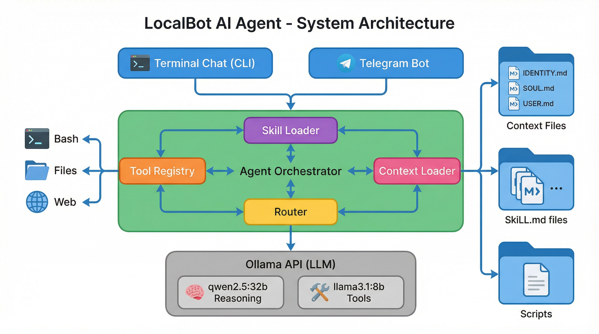
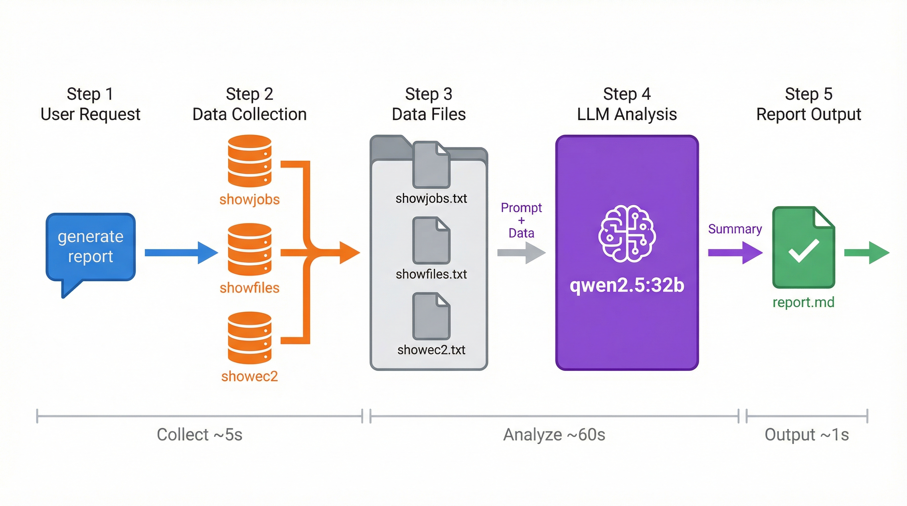

# System Architecture

Detailed explanation of how LocalBot works internally.

## Architecture Overview



LocalBot is a modular AI agent system with the following layers:

### User Interface Layer

Two interfaces for interacting with the system:

| Interface | Entry Point | Features |
|-----------|-------------|----------|
| **Terminal Chat** | `npm run chat` | Interactive CLI, commands, streaming |
| **Telegram Bot** | `npm run bot` | Mobile access, auto-skill detection |

Both interfaces share the same core Agent system.

### Core System Layer

#### Agent Orchestrator (`src/agent/agent.ts`)

The central coordinator that:

1. Receives user messages
2. Routes to appropriate model via Router
3. Manages conversation history
4. Orchestrates tool execution loop
5. Streams responses back to interface

**Conversation Loop:**
```
User Message
    ↓
[Route to Model]
    ↓
[LLM Response]
    ↓
[Has Tool Calls?] → Yes → [Execute Tools] → [Return Results] → [Loop]
    ↓ No
[Return Final Response]
```

Maximum 10 tool execution rounds per request.

#### Tool Registry (`src/tools/registry.ts`)

Manages all available tools:

```typescript
// Built-in tools
- bash         // Execute shell commands
- read_file    // Read file contents
- write_file   // Write files
- edit_file    // Edit files
- list_files   // List directory
- web_search   // Search the web
- web_fetch    // Fetch URL content
- browser      // Browser automation
- gmail_*      // Gmail integration
- calendar_*   // Google Calendar
- api_request  // HTTP requests
- memory_*     // Semantic memory (optional)
```

Tools are OpenAI-compatible function definitions.

#### Skill Loader (`src/skills/loader.ts`)

Loads prompt skills from multiple directories:

```
Load Order (lowest → highest priority):
1. Extra dirs (LOCALBOT_EXTRA_SKILLS_DIRS)
2. ~/.localbot/skills-bundled/
3. ~/.localbot/skills/
4. ./skills/
```

Skills can be:
- Single files: `skill-name.md`
- Directories: `skill-name/SKILL.md`

#### Context Loader (`src/context/loader.ts`)

Loads personal context files:

```
~/clawd/           (global)
  ├── IDENTITY.md  → Bot name, personality
  ├── SOUL.md      → Behavior guidelines
  ├── USER.md      → User preferences
  └── TOOLS.md     → Tool usage notes

./agent/           (workspace, overrides global)
  └── *.md
```

Builds system prompt from context files.

#### Router (`src/router/router.ts`)

Intelligent model selection:

```typescript
// Hybrid routing configuration
{
  reasoningModel: 'qwen2.5:32b',  // Complex understanding
  toolCallingModel: 'llama3.1:8b' // Fast execution
}
```

**Routing Logic:**
1. Check if message is simple conversation → disable tools
2. Check if task needs tools → use toolCallingModel
3. Check if task needs reasoning → use reasoningModel
4. Verify model supports required capabilities

### Provider Layer

#### Ollama Provider (`src/agent/providers/ollama.ts`)

Direct connection to Ollama API:

```
┌─────────────────────┐
│    LocalBot Agent   │
└──────────┬──────────┘
           │ HTTP
           ▼
┌─────────────────────┐
│    Ollama API       │
│  /api/chat          │
│  /api/generate      │
└──────────┬──────────┘
           │
     ┌─────┴─────┐
     ▼           ▼
┌─────────┐ ┌─────────┐
│qwen2.5  │ │llama3.1 │
│  :32b   │ │  :8b    │
└─────────┘ └─────────┘
```

Supports:
- Streaming responses
- Tool/function calling
- Model listing
- Model info

## Data Flow

### Request Flow

```
1. User Input
   │
   ▼
2. Interface (Terminal/Telegram)
   │ Parse message, check for commands
   ▼
3. Skill Detection (Bot only)
   │ Match keywords → inject skill content
   ▼
4. Agent.runStream()
   │
   ▼
5. Router.selectModel()
   │ Choose model based on task
   ▼
6. Provider.chatStream()
   │ Send to Ollama
   ▼
7. LLM Response
   │
   ├─→ [Content] → Stream to user
   │
   └─→ [Tool Calls] → Execute → Return results → Loop to step 6
```

### Tool Execution Flow

```
LLM Response with tool_calls
        │
        ▼
┌───────────────────┐
│  ToolExecutor     │
│  - Parse args     │
│  - Validate       │
│  - Execute        │
│  - Handle errors  │
└───────────────────┘
        │
        ▼
┌───────────────────┐
│  Tool Results     │
│  - stdout/stderr  │
│  - Success/Error  │
└───────────────────┘
        │
        ▼
    Back to LLM
```

### Skill Injection Flow

```
User: "show my tibanna jobs"
        │
        ▼
┌───────────────────┐
│ Keyword Matching  │
│ "tibanna" matches │
│ genomics-jobs     │
└───────────────────┘
        │
        ▼
┌───────────────────┐
│ Direct Command?   │
│ "show job" →      │
│ showjobs command  │
└───────────────────┘
        │
        ▼
┌───────────────────┐
│ Inject into msg:  │
│ EXECUTE: showjobs │
│ Original: ...     │
└───────────────────┘
        │
        ▼
    Send to Agent
```

## Report Generation Workflow



The genomics-report system follows this flow:

### Step 1: User Request

User triggers report via:
- Command: `/Users/zayed/clawd/scripts/genomics-report.sh "question"`
- Skill: "generate genomics report"
- Keywords: "pipeline report", "job summary"

### Step 2: Data Collection

Script collects data from three sources:

```bash
showjobs -n 100 > showjobs.txt    # Job status from DynamoDB
showfiles > showfiles.txt          # Output files
showec2 > showec2.txt              # EC2 instances
```

### Step 3: Prompt Building

Combines:
- System prompt (analyst role)
- User question
- Collected data (in code blocks)
- Analysis instructions

### Step 4: LLM Analysis

Calls Ollama API:

```bash
curl $OLLAMA_HOST/api/generate \
  -d '{"model": "qwen2.5:32b", "prompt": "..."}'
```

LLM analyzes data and generates:
- Summary statistics
- Issue identification
- Recommendations

### Step 5: Report Output

Generates `report.md` with:
- Metadata (date, model, question)
- LLM analysis
- Raw data location

## Component Interactions

### Startup Sequence

```
1. Load environment (.env)
2. Initialize Ollama Provider
3. Initialize Tool Registry
4. Register built-in tools
5. Load tool skills (YAML)
6. Load prompt skills (MD)
7. Load context files
8. Build system prompt
9. Create Agent
10. Start interface (Terminal/Bot)
```

### Message Processing Sequence

```
Terminal:                          Bot:
─────────                          ─────
/skill genomics-jobs               [Auto-detect skill]
        │                                  │
        ▼                                  ▼
activeSkill = genomics-jobs        matchSkillByKeywords()
        │                                  │
        ▼                                  ▼
User: "show jobs"                  User: "show tibanna jobs"
        │                                  │
        ▼                                  ▼
Inject skill content               findDirectCommand()
        │                                  │
        ▼                                  ▼
agent.runStream()                  "EXECUTE: showjobs"
        │                                  │
        ▼                                  ▼
[Same Agent processing]            agent.runStream()
```

## File Structure

```
serve_ollama/
├── src/
│   ├── agent/
│   │   ├── agent.ts        # Main agent orchestrator
│   │   └── providers/
│   │       ├── base.ts     # Provider interface
│   │       ├── ollama.ts   # Ollama implementation
│   │       └── litellm.ts  # LiteLLM implementation
│   │
│   ├── tools/
│   │   ├── registry.ts     # Tool registration
│   │   ├── executor.ts     # Tool execution
│   │   ├── skill-loader.ts # YAML skill loader
│   │   └── built-in/
│   │       ├── bash.ts
│   │       ├── files.ts
│   │       ├── web.ts
│   │       └── ...
│   │
│   ├── skills/
│   │   ├── loader.ts       # MD skill loader
│   │   └── types.ts        # Skill types
│   │
│   ├── context/
│   │   └── loader.ts       # Context file loader
│   │
│   ├── router/
│   │   └── router.ts       # Model routing
│   │
│   ├── terminal/
│   │   └── ui.ts           # Terminal interface
│   │
│   └── telegram/
│       ├── bot.ts          # Telegram bot
│       └── session/        # Session management
│
├── docs/                   # This documentation
├── config/                 # Configuration files
└── skills/                 # Workspace skills
```

## Extension Points

### Adding New Tools

```typescript
// src/tools/built-in/my-tool.ts
export const myTool: Tool = {
  name: 'my_tool',
  description: 'What it does',
  parameters: {
    type: 'object',
    properties: {
      input: { type: 'string' }
    },
    required: ['input']
  },
  async execute(args) {
    return 'result';
  }
};

// Register in src/tools/built-in/index.ts
```

### Adding New Providers

```typescript
// src/agent/providers/my-provider.ts
export class MyProvider extends BaseProvider {
  async chat(request) { ... }
  async *chatStream(request) { ... }
  async listModels() { ... }
}
```

### Adding New Skills

Create `~/clawd/skills/my-skill/SKILL.md`:

```markdown
---
name: my-skill
description: ...
triggers: [...]
---

# Content
```

## Performance Considerations

### Model Selection

| Model | Speed | Quality | VRAM |
|-------|-------|---------|------|
| llama3.1:8b | Fast | Good | 5GB |
| qwen2.5:14b | Medium | Better | 9GB |
| qwen2.5:32b | Slow | Best | 20GB |

### Optimization Tips

1. **Use hybrid routing** - Fast model for tools, smart for reasoning
2. **Limit context** - Keep skills focused, avoid huge prompts
3. **Direct commands** - Map common queries to specific commands
4. **Jobs-only reports** - Use `--jobs-only` for faster reports

### Memory Usage

- Each conversation stored in memory (SessionManager)
- Context loaded once at startup
- Skills loaded once, cached
- Tool results not persisted
